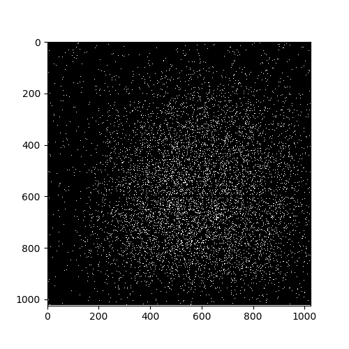

# SBC Background Subtraction

This project reduce the background of the HST Solar Blind Channel (SBC) Multi Anode Microchannel Array (MAMA) image.

The main sources of the background are sky background and dark current.
The sky background are scattered lights of the astronomical object, assumed to be uniformed in space. 
The dark current is the thermal noise of the instrument, which has a spatial pattern that the background level is higher at the center region of the image.

* dark current is higher at the center region.  The horizontal lines are bad pixels with pixel value = 0 

This code is a modified version of [GitHub Pages](https://github.com/sourabhsc/dark_subtraction_sbc). To fit my purpose, the annulus of the background do not have to centered at the center of the image. (The object is not in the center of the image.) 

In this code, there are two ways to remove the background: 
## 1. Sky subtraction only: ##
The temperature of the detector is recorded in the header.  If the temperature is low enough, we can neglect the dark current and simply subtract a constant value throughout the image. The cutoff temperature is around 22 degree.  When temperature <22,  we produce annuli from r_in to r_out with width of 1, where r_in = 150 and r_out =250. We calculate the mean of the pixel value inside the annulus, and take the median of all mean as the sky background. 

note1: This calculation slightly prefer the pixels closer to the object. If the dark current is truely negligible, this is a monor concern. 
note2: Taking median of the means of all annulus help us avoid the unidentified hot pixels.
note3: Since most of the pixels have value = 0, directly taking median of all pixel values between r_in and r_out will result to zero. 

## 2. Sky + dark subtraction: ##
If the science exposure temperature > temp_cutoff (= 22, empirically), we will subtract the background by : 

sci_fd(i, j) = sci_flt(i, j) - A * ts/td * drk_flt(i, j) - K

where sci_fd(i, j) is the product image, sci_flt(i, j) is the science flat image. 
A is the scale paramter (scalar) for the dark current. 
drk_flt(i, j) is the dark flat image, where you can download the raw image and reduce using acstool.[1] 
ts, td are the exposure time of the science exposure and dark image, respectively.  (td = 1000 seconds)
K is the constant sky background. 

to determine the parameter A and sky, we find the minimum of the residue : 

residue = Sum[ Ring_i((sci - A * ts/td * drk - K)^2)  for i in range(r_in, r_out)  ]

through out the paramter space of A~[0 : 2] and K~[0 : 0.02].  

The range of parameter spaces of A and K are decided empirically again. It is important to check if the values we pick hit the boundary or not. 
Ring_i is the annulus with the width of 1. We create annuli from r_in to r_lim.  ( r_lim is the radius where it cuts the edge of the image.) 
For the pixels inside each rings, we calculate the mean of " (sci(i, j) - A * ts/td * drk(i, j) - K)^2 ", then sum these means as residue. 

If we sum over the whole annulus from r_in to r_out without choping it into sub-annulus with the width of 1, we might find solutions that has higher background at  the inner region, and lower (negative) background at oputter region, but cancel each other in the sum.  Choping into sub-annulus allow us to find solutions such that each residual of the rings are close to zero. 

note1: In principle, having a more delicate grid of A and K will give you a better result.  However this is not really efficient, and the result looks similar. 
note2: 

[1] to download dark images: [link](https://stsci.edu/hst/instrumentation/acs/calibration)

## Steps of using this code ##
0. install numpy, astropy, pathlib. 

1. put the fits file (rootname_flt.fits) you want to reduce in [PATH_TO_DATA], and assign flt_dir='[PATH_TO_DATA]'

2. put the dark_flt images that corresponds to the data in [PATH_TO_DRK], and assign flt_dir='[PATH_TO_DRK]'

3. Some paramters that's easy to adjust includes temperature cutoff "temp_cutoff = 22", size of the inner radius " rf = 150 " (which is r_in), number of annuli for the sky subtraction "sky_apt_size = 100" (r_in + sky_apt_size = r_out). 

4. The result will be in [PATH_TO_DATA]/product/, named as rootname_fd.fits. 

5. An analysis figur will be created in [PATH_TO_DATA]/product/plot/. 

*  On the left panel, y axis is the sum of the pixel values within the annulus of r_in = x, r_out = x+1. The white annulus on the right is the region that involve the background subtraction.  

*  A result of sky subtraciton only.  As we see, the outter part of the image is over-subtract.  This exposure has temperature =20.4.  
*  You can blame on the shape and size of the background apreture, but the curve close to the source is flat. 

*  If we apply sky+dark subtraction instead,  the resulted background curve will be flat.  But it can either be interprete as the image in fact has dark current contribution, or simply because we have more paramters to fit with.
